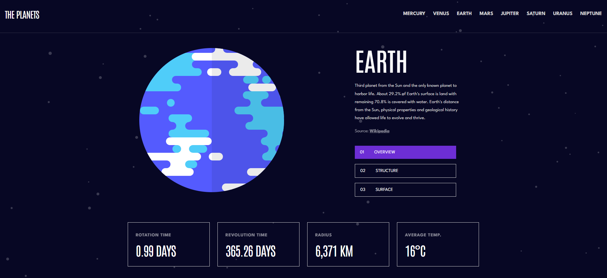
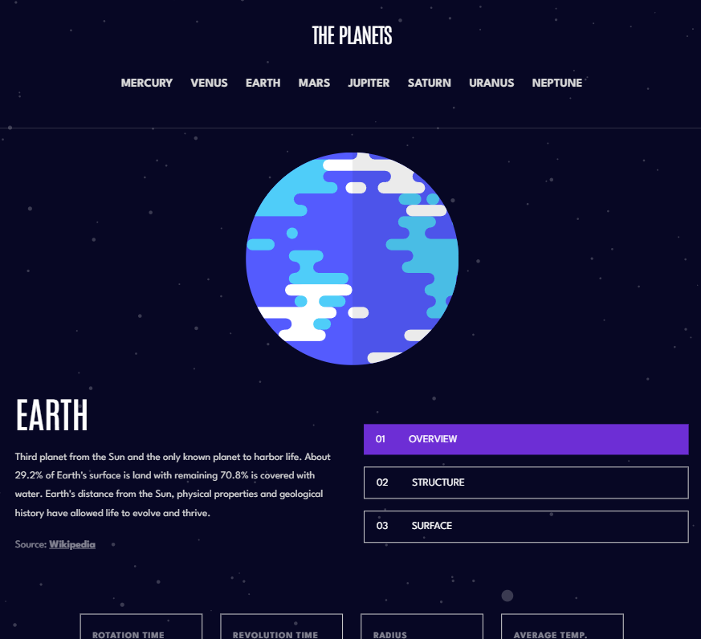
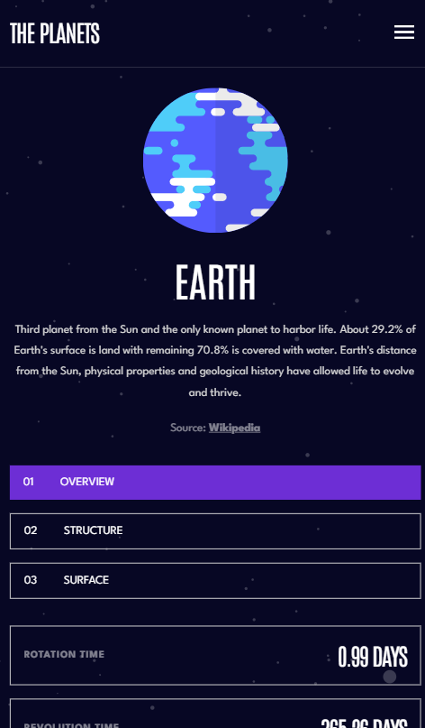

<h1 align="center"> Frontend Mentor - Planets Fact Site</h1>

Essa é uma solução para o [Desafio Planets Fact Site](https://www.frontendmentor.io/challenges/planets-fact-site-gazqN8w_f). Os desafios do Frontend Mentor ajudam você a aprimorar suas habilidades de programação por meio da criação de projetos realistas.

    

## 💻 Projeto

Este projeto é um site de fatos sobre planetas. Nele você pode ver fatos sobre todos os planetas do sistema solar, incluindo uma visão geral, estrutura interna e superfície

## Acesse o Planets Fact Site [clicando aqui](https://planets-fact-site-nine-gilt.vercel.app/)

## 🚀 Tecnologias

Esse projeto foi desenvolvido com as seguintes tecnologias:

- JavaScript
- CSS
- React
- Git e GitHUb

## Screenshot do resultado

### Versão Desktop

 
    

### Versão Tablet

 
    

### Versão Mobile

 
    

## Autor 

- Website - [Antônio Rafael](https://github.com/antoniorafaeldev)
- Frontend Mentor - [@Antonio-Rafael-Silva](https://www.frontendmentor.io/profile/antoniorafaeldev)
- Linkedin - [Antônio Rafael](https://www.linkedin.com/in/ant%C3%B4nio-rafael-01131b372/)